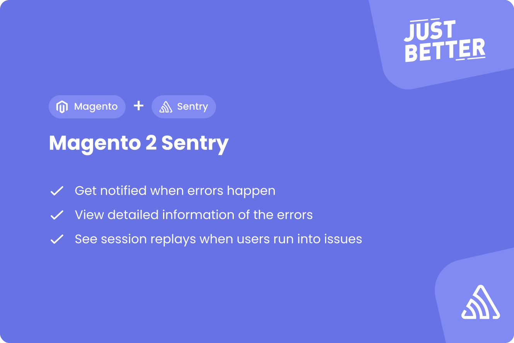

<a href="https://github.com/justbetter/magento2-sentry" title="JustBetter">
    
</a>


# Magento 2 Sentry Logger
[](https://packagist.org/packages/justbetter/magento2-sentry)
[](https://packagist.org/packages/justbetter/magento2-sentry)

[](https://github.com/justbetter/magento2-sentry/actions/workflows/analyse.yml)

This Magento 2 module integrates [Sentry](https://github.com/getsentry/sentry-php) into magento 2. 
Depending on the log level configured in the backend of magento 2, notifications and errors can be sent to sentry.

## Features

- Send exceptions and logs to Sentry
- Show detailed context on thrown exceptions (Like Magento user/api consumer id)
- Easily control which events get sent to Sentry
- Backend and frontend error reporting
- Session replay
- Logrocket support
- Sentry feedback form after an error

## Installation
- `composer require justbetter/magento2-sentry`
- `bin/magento module:enable JustBetter_Sentry`
- `bin/magento setup:upgrade`
- `bin/magento setup:di:compile`
- `bin/magento setup:static-content:deploy`

## Configuration
For configuration with Adobe Cloud, [check below](#configuration-for-adobe-cloud).

This module uses the [Magento Deployment Configuration](https://devdocs.magento.com/guides/v2.3/config-guide/config/config-php.html) for most it's configuration. This means that you need to add this array to your `app/etc/env.php`:

```
'sentry' => [
    'dsn' => 'example.com',
    'logrocket_key' => 'example/example',
    'environment' => null,
    'log_level' => \Monolog\Logger::WARNING,
    'error_types' => E_ALL,
    'ignore_exceptions' => [],
    'mage_mode_development' => false,
    'js_sdk_version' => \JustBetter\Sentry\Block\SentryScript::CURRENT_VERSION,
    'tracing_enabled' => true,
    'traces_sample_rate' => 0.5,
    'disable_default_integrations' => [
        \Sentry\Integration\ModulesIntegration::class,
    ]
    'performance_tracking_enabled' => true,
    'performance_tracking_excluded_areas' => [\Magento\Framework\App::AREA_ADMINHTML, \Magento\Framework\App::AREA_CRONTAB],
    'profiles_sample_rate' => 0.5,
    'ignore_js_errors' => []
]
```

Next to that there are some configuration options under Stores > Configuration > JustBetter > Sentry.

### Configuration values
| Name | Default | Description |
|---|---|---|
| `dsn`                       | — | The DSN you got from Sentry for your project. You can find the DSN in the project settings under "Client Key (DSN)" |
| `environment`               | — | Specify the environment under which the deployed version is running. Common values: production, staging, development. Helps differentiate errors between environments. |
| `log_level`                 | `\Monolog\Logger::WARNING` | Specify from which logging level on Sentry should get the messages. |
| `error_types`  | `E_ALL` | If the Exception is an instance of [ErrorException](https://www.php.net/manual/en/class.errorexception.php), send the error to Sentry if it matches the error reporting. Uses the same syntax as [Error Reporting](https://www.php.net/manual/en/function.error-reporting.php), e.g., `E_ERROR` | E_WARNING`. |
| `ignore_exceptions`         | `[]` | If the class being thrown matches any in this list, do not send it to Sentry, e.g., `[\Magento\Framework\Exception\NoSuchEntityException::class]` |
| `clean_stacktrace`          | `true` | Whether unnecessary files (like Interceptor.php, Proxy.php, and Factory.php) should be removed from the stacktrace. (They will not be removed if they threw the error.) |
| `mage_mode_development`     | `false` | If set to true, you will receive issues in Sentry even if Magento is running in develop mode. |
| `js_sdk_version`            | `\JustBetter\Sentry\Block\SentryScript::CURRENT_VERSION` | If set, loads the explicit version of the JavaScript SDK of Sentry. |
| `tracing_enabled`           | `false` | If set to true, tracing is enabled (bundle file is loaded automatically). |
| `traces_sample_rate`        | `0.2` | If tracing is enabled, set the sample rate. |
| `performance_tracking_enabled` | `false` | if performance tracking is enabled, a performance report got generated for the request. |
| `performance_tracking_excluded_areas` | `['adminhtml', 'crontab']` | if `performance_tracking_enabled` is enabled, we recommend to exclude the `adminhtml` & `crontab` area. |
| `profiles_sample_rate` | `0` (disabled) | if this option is larger than 0 (zero), the module will create a profile of the request. Please note that you have to install [Excimer](https://www.mediawiki.org/wiki/Excimer) on your server to use profiling. [Sentry documentation](https://docs.sentry.io/platforms/php/profiling/). You have to enable tracing too. |
| `ignore_js_errors`          | `[]` | Array of JavaScript error messages which should not be sent to Sentry. (See also `ignoreErrors` in [Sentry documentation](https://docs.sentry.io/clients/javascript/config/)) |
| `disable_default_integrations` | `[]` | Provide a list of FQCN of default integrations you do not want to use. [List of default integrations](https://github.com/getsentry/sentry-php/tree/master/src/Integration).|

### Configuration for Adobe Cloud
Since Adobe Cloud doesn't allow you to add manually add content to the `env.php` file, the configuration can be done
using the "Variables" in Adobe Commerce using the following variables:

| Name                                             | Type    |
|--------------------------------------------------|---------|
| `CONFIG__SENTRY__ENVIRONMENT__ENABLED`           | boolean |
| `CONFIG__SENTRY__ENVIRONMENT__DSN`               | string  |
| `CONFIG__SENTRY__ENVIRONMENT__LOGROCKET_KEY`     | string  |
| `CONFIG__SENTRY__ENVIRONMENT__ENVIRONMENT`       | string  |
| `CONFIG__SENTRY__ENVIRONMENT__LOG_LEVEL`         | integer |
| `CONFIG__SENTRY__ENVIRONMENT__ERROR_TYPES`       | integer |
| `CONFIG__SENTRY__ENVIRONMENT__IGNORE_EXCEPTIONS` | JSON array of classes |
| `CONFIG__SENTRY__ENVIRONMENT__CLEAN_STACKTRACE`  | boolean |
| `CONFIG__SENTRY__ENVIRONMENT__MAGE_MODE_DEVELOPMENT` | string  |
| `CONFIG__SENTRY__ENVIRONMENT__JS_SDK_VERSION`    | string  |
| `CONFIG__SENTRY__ENVIRONMENT__TRACING_ENABLED`   | boolean |
| `CONFIG__SENTRY__ENVIRONMENT__TRACING_SAMPLE_RATE` | float   |
| `CONFIG__SENTRY__ENVIRONMENT__TRACING_PERFORMANCE_TRACKING_ENABLED` | boolean |
| `CONFIG__SENTRY__ENVIRONMENT__TRACING_PERFORMANCE_TRACKING_EXCLUDED_AREAS` | boolean |
| `CONFIG__SENTRY__ENVIRONMENT__IGNORE_JS_ERRORS`  | JSON array of error messages |

The following configuration settings can be overridden in the Magento admin. This is limited to ensure that changes to
particular config settings can only be done on server level and can't be broken by changes in the admin.

Please note, that it is not possible to use profiling within the Adobe Cloud.

## Optional error page configuration
- Optional you can configure custom error pages in pub/errors. You can use the sentry feedback form and insert here the sentry log ID. The Sentry Log Id is captured in de customer session and can be retrieved in `processor.php`.

## Sending additional data to Sentry when logging errors
- When calling any function from the [Psr\Log\LoggerInterface](https://github.com/php-fig/log/blob/master/src/LoggerInterface.php) you can pass any data to the parameter $context and it will be send to Sentry as 'Custom context'.

## Change / Filter events
This module has an event called `sentry_before_send` that is dispatched before setting the config [before_send](https://docs.sentry.io/platforms/php/configuration/filtering/#using-platformidentifier-namebefore-send-). This provides the means to edit / filter events. You could for example add extra criteria to determine if the exception should be captured to Sentry. To prevent the Exception from being captured you can set the event to `null` or unset it completly.

```PHP
public function execute(\Magento\Framework\Event\Observer $observer)
{
    $observer->getEvent()->getSentryEvent()->unsEvent();
}
```

Example: https://github.com/justbetter/magento2-sentry-filter-events

This same thing is the case for
| sentry_before_send | https://docs.sentry.io/platforms/php/configuration/options/#before_send |
| sentry_before_send_transaction | https://docs.sentry.io/platforms/php/configuration/options/#before_send_transaction |
| sentry_before_send_check_in | https://docs.sentry.io/platforms/php/configuration/options/#before_send_check_in |
| sentry_before_breadcrumb | https://docs.sentry.io/platforms/php/configuration/options/#before_breadcrumb |

## Compatibility
The module is tested on Magento version 2.4.x with sentry sdk version 3.x. feel free to fork this project or make a pull request.

## Ideas, bugs or suggestions?
Please create a [issue](https://github.com/justbetter/magento2-sentry/issues) or a [pull request](https://github.com/justbetter/magento2-sentry/pulls).

## Contributing
Contributing? Awesome! Thank you for your help improving the module!

Please see [CONTRIBUTING](.github/CONTRIBUTING.md) for details.

Most importantly:
- When making a PR please add a description what you've added, and if relevant why.
- To save time on codestyle feedback, please run 
    - `composer install`
    - `composer run codestyle`
    - `composer run analyse`

## Security Vulnerabilities

Please review [our security policy](../../security/policy) on how to report security vulnerabilities.

## License

The MIT License (MIT). Please see [License File](LICENSE) for more information.

<a href="https://justbetter.nl" title="JustBetter">
    
</a>
